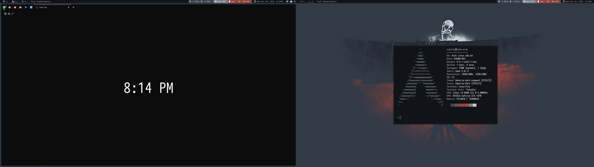

# Dotfiles
Most of them I got it from internet and modified it. Feel free to use. Stuff might be messy.

Inspired by [this](https://www.reddit.com/r/unixporn/comments/asoyk1/i3_attack_on_arch/) reddit post.

## Screenshot

## Some details
- **OS**: Arch Linux
- **WM**: i3-gaps
- **Composition Manager**: Picom
- **GTK Theme**: Materia-dark-compact
- **Wallpaper**: [Titan](https://wall.alphacoders.com/big.php?i=607866&lang=Portuguese)
- **Color scheme**: Pywal
- **Terminal**: Alacritty
- **Shell**: Fish
- **Anime list**: [https://anilist.co/user/352980](https://anilist.co/user/352980)